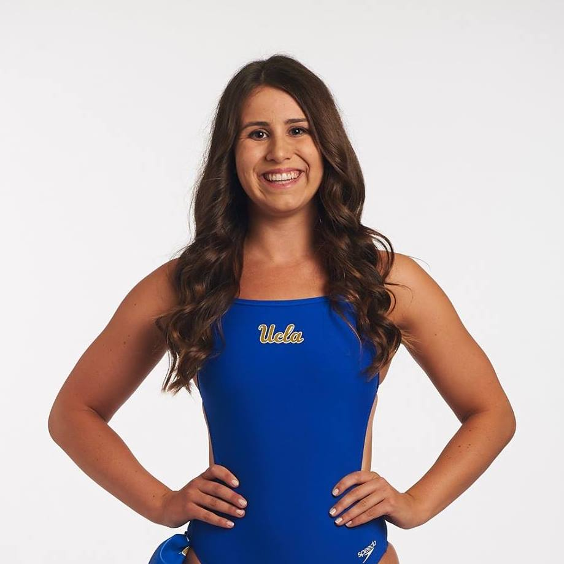
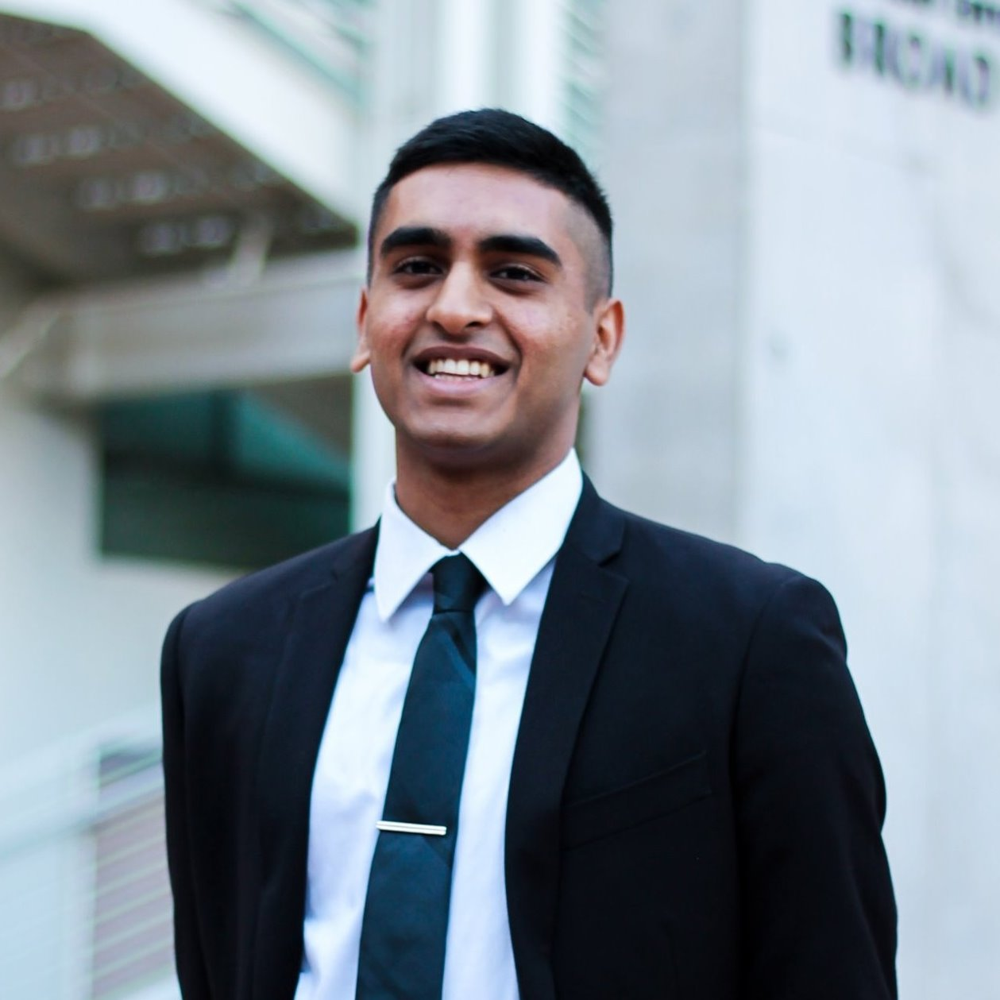
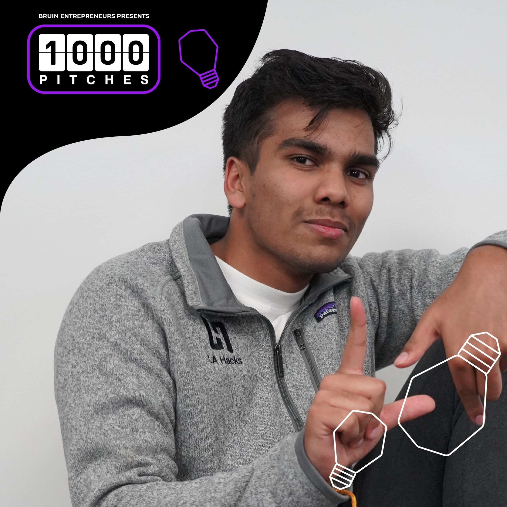

# Team
|Name|Github|Photo|
|---|---|---|
|Elena Escalas|<a href="https://github.com/rVrengaraju">EEscalas</a>||
|Kevin Tan|<a href="https://github.com/rVrengaraju">ktan17</a>||
|Lucas Xia|<a href="https://github.com/rVrengaraju">lucasxia01</a>||
|Sai Atmakuri|<a href="https://github.com/rVrengaraju">saiguy3</a>||
|Sriram Balachanran|<a href="https://github.com/rVrengaraju">sriramb2000</a>||

## Section
We will be attending **Section 1A (12 - 2pm)**.

## Project Description
Radius is a location-based social media app, focused on facilitating real human connection with the people that you pass by on a day-to-day basis. Discover and interact with users in your radius and expand your social network.
